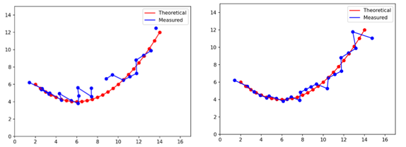
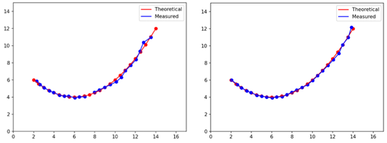

# Project DSP Drone

## Formulles
$$ PDP(t) = \int_{-∞}^{+∞}​H(f)⋅e^{2πjωt} \;df $$
$$ APDP(t) = \frac{1}{N} \sum_{i=1}^{N}​​PDP_i​(t) $$

## Traject
**Dataset 1**

- Links: zonder window, Rechts: met window

**Dataset 2**

- Links: zonder window, Rechts: met window

## Mediaan fout
|           | Zonder Window              | Met Window                  |
| --------- | -------------------------- | --------------------------- |
| Dataset 1 | (Niet Reëel, 0.48707976) m | (0.17201846, 0.24363594) m  |
| Dataset 2 | (Niet Reëel, 0.06580386) m | (0.03554293, 0.046664205) m |
